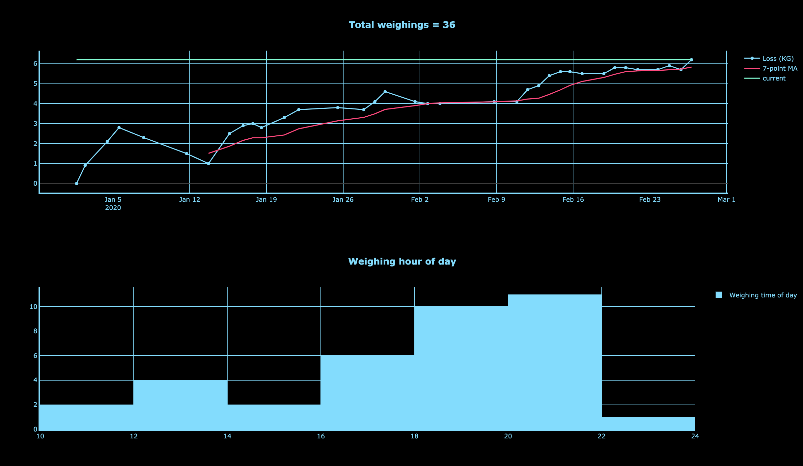

# Weight data analysis

- Downloading weight data stored in a Google Sheet
- Storing the data in, and regularly updating a Postgres (originally SQLite3) database by checking the Google Sheet for updates, with a cron job.
- Originally regularly updated a Jupyter Notebook with a cron job, and then tried [Dash](https://plot.ly/dash/) and [Streamlit](https://www.streamlit.io/).

